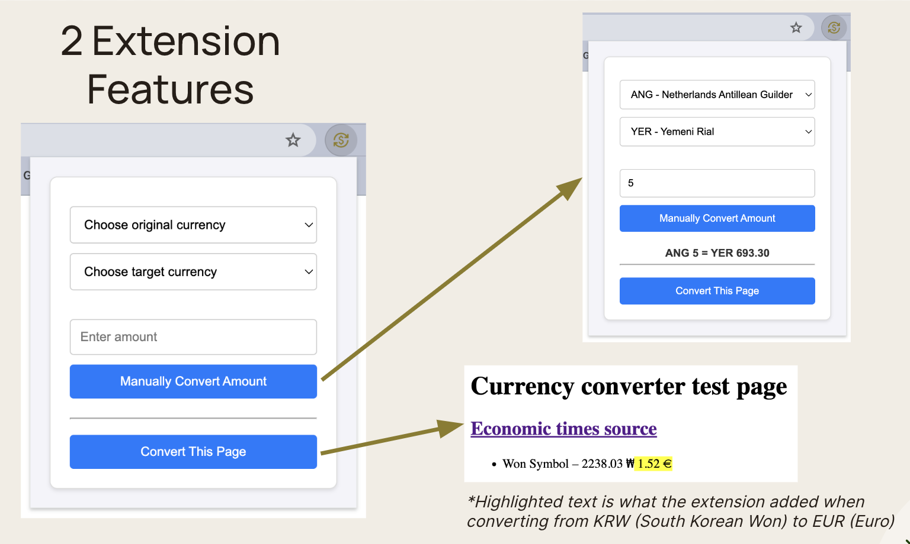
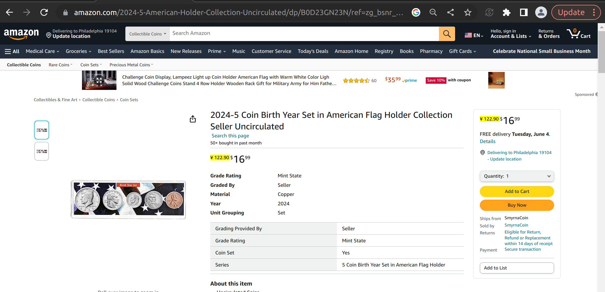
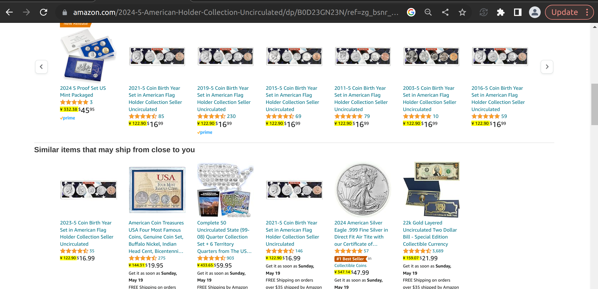
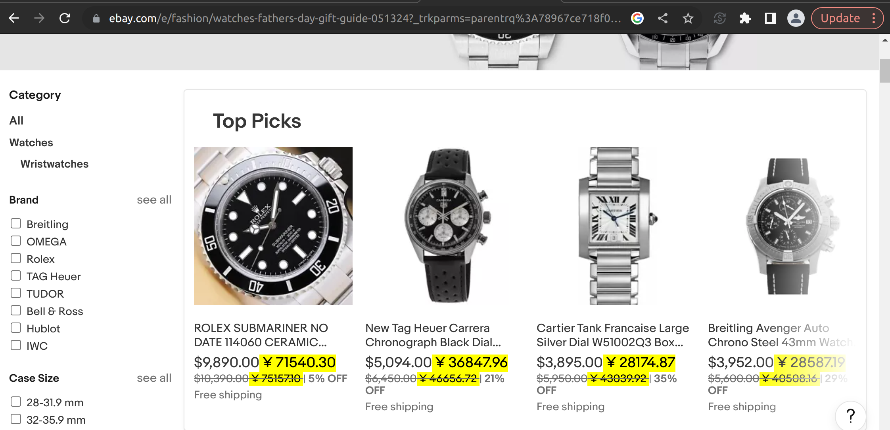

# Currency Converter Chrome Extension

## Table of Contents
1. [Project Overview](#project-overview)
2. [Our Problem Statement](#our-problem-statement)
3. [Features](#features)
4. [How To Install](#how-to-install)
   - [Cloning the Repository](#cloning-the-repository)
   - [Loading the Extension in Chrome](#loading-the-extension-in-chrome)
5. [Usage](#usage)
6. [How It Works](#how-it-works)
7. [Contributing](#contributing)
8. [License](#license)

## Project Overview

_Currency Converter_ is a Chrome extension that integrates real-time currency conversion directly into your browsing experience. You can instantly convert prices on any webpage to your home currency with a simple click. This seamless and streamlined in-page conversion tool eliminates the clutter of any extra tabs to manually convert and calculate. You can access the landing page for this extension by going to https://cherilynnchow.github.io/currency-converter-landing-page/

## Our Problem Statement

Online shoppers, travelers, and finance enthusiasts frequently see prices listed in foreign currencies when browsing the internet. This creates a challenge in quickly understanding the true cost of products, services, or investments in their home currency. Users often resort to manual conversions using separate apps or websites, interrupting their browsing experience, or rely on mental approximations, which can be inaccurate.

Our target audience for the Currency Converter extension project includes online shoppers buying from international websites, travelers planning trips or purchases in different countries, financial analysts and investors monitoring international markets, students and professionals engaging with international documents and reports, and anyone who might need quick and accurate currency conversions without interrupting their browsing flow.

## Features

- **Real-time price conversion.** Instantly convert prices directly on web pages without navigating away. Up-to-date exchange rates are fetched automatically in the background.
- **All automatic.** Recognizes and highlights prices on web pages for seamless conversion.
- **Manual mode.** You can use a pop-up on your browser to manually convert any prices without navigating away from the page you're on.
- **Extensive currency support.** Provides conversion for a wide range of global currencies, all updated in real-time.
- **Simplicity and fast usability.** The fast rendering simplifies shopping, travel planning, and financial analysis.

## How To Install

### Cloning the Repository and Installing Dependencies

1. To get started, you'll need to clone the repository to your local machine. Open your terminal app of choice and run the command:

   ```sh
   git clone https://github.com/mreguler/currency-converter.git
   ```
2. Then, cd into the extension folder:
   ```bash
   cd currency-converter
   ```
5. Install dependencies in the terminal:
   ```bash
   npm install
   ```
6. Run the build:
   ```bash
   npm run build
   ```

### Loading the Extension in Chrome

1. Open Google Chrome and navigate to `chrome://extensions/`.
2. Enable "Developer mode" by toggling the switch in the top right corner.
3. Click on the "Load unpacked" button.
4. Select the cloned repository folder (`currency-converter`) to load the extension.

The Currency Converter extension should now be installed and visible in your Chrome extensions list.

## Usage

1. Click on the Currency Converter icon in the Chrome toolbar to open the extension.
2. Select the currencies you want to convert from and to.
3. Enter the amount you wish to convert.
4. The converted amount will be displayed instantly.

You also have the choice to automatically convert all prices on the current webpage to your favorite currency.

## How It Works



The Currency Converter Chrome Extension operates as follows:

1. **Frontend UI.** The extension popup contains a user-friendly interface for selecting currencies and entering the amount to be converted.
2. **Exchange rate API.** The extension fetches real-time exchange rates from a reliable API (that is, [ExchangeRate-API](https://www.exchangerate-api.com/)).
3. **Conversion logic.** The extension calculates the converted amount based on the fetched exchange rates and displays the result in the popup.

## Demo screenshots




## Blog Post

Access our blog post [here](https://cherilynnchow.github.io/currency-converter-landing-page/post/hugo-v0-119/).

## Contributing

We welcome contributions from the community. To contribute:

1. Fork the repository.
2. Create a new branch with a descriptive name.
3. Make your changes and commit them with clear messages.
4. Push your branch to your forked repository.
5. Create a pull request to the `main` repository.

## Issues

File comments, concerns, or issues by [opening an issue](https://github.com/mreguler/currency-converter/issues/new) on Github.

## License
This project is made by Cherilynn Chow, Kim Fung, Sam May, and Emre Guler. It's licensed under the MIT License.
